# Информация

Раздел содержит информацию о мини-приложении, которую пользователь видит при запуске и которая необходима для публикации в каталоге. Заполните поля этого раздела, чтобы мини-приложение стало информативным и привлекательным для пользователей.

Если эти поля не заполнять, мини-приложение не пройдёт модерацию и не будет опубликовано в каталоге.

Чтобы перейти в раздел, откройте Мои приложения → Редактировать → Информация.

Информация

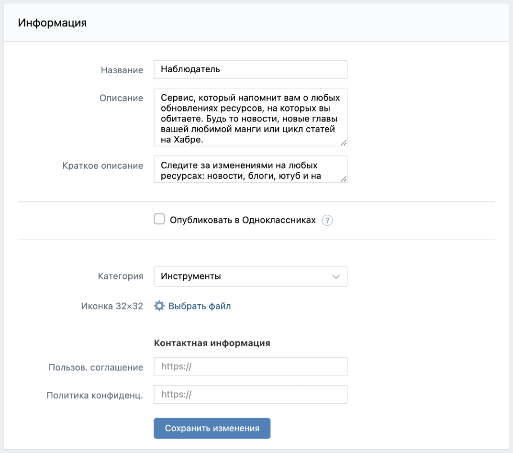

Блок Информация содержит следующие обязательные поля:

• Название

• Категория

Название

• Название мини-приложения может содержать только буквы, цифры, дефисы, запятые и пробелы.

• Максимальное количество символов — 34.

Описание

Описание мини-приложения отображается в разделе О приложении в мобильном приложении ВКонтакте.

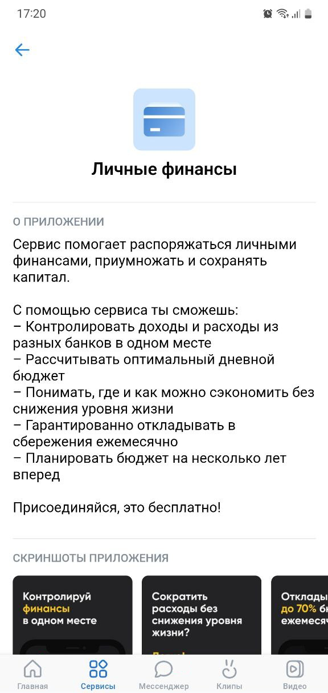

Максимальное количество символов — 2000.

Как найти:

1. Откройте мобильное приложение ВКонтакте.
2. Перейдите в раздел Сервисы.
3. Выберите мини-приложение и нажмите кнопку •••.
4. Нажмите кнопку О приложении.

Краткое описание

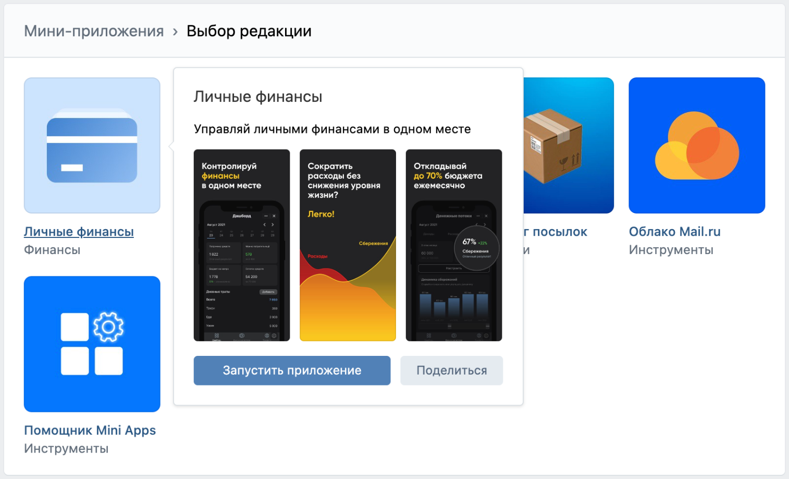

Краткое описание мини-приложения отображается в каталоге.

Максимальное количество символов — 128.

Как найти:

• Наведите курсор на название мини-приложения в каталоге.

• В сниппете сервиса.

Опубликовать в Одноклассниках

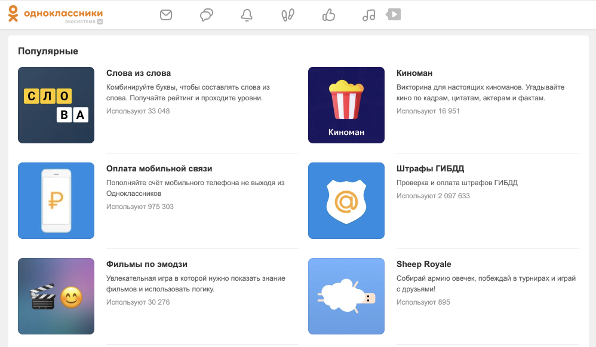

Чтобы опубликовать мини-приложение в каталоге Одноклассников:

1. Установите флажок Опубликовать в Одноклассниках.
2. Нажмите кнопку Получить ОК id.
3. В окне Одноклассники:

• Авторизуйтесь.

    Если к вашей учётной записи в Одноклассниках не привязан адрес электронной почты, привяжите его в личном кабинете.

• Выберите Мной прочитаны и принимаются условия соглашения.

• Нажмите кнопку Получить права разработчика. Поле ОК User ID заполнится автоматически.

Подробнее о модерации мини-приложения в Одноклассниках читайте в официальной документации.

Категория

Выберите категорию, чтобы при модерации мини-приложение было распределено в самый подходящий раздел. После модерации категория в блоке Информация может не совпадать с категорией, в которую попало мини-приложение.

Иконка

Иконка — это значок мини-приложения, который отображается на вкладке окна в браузере.

• Размер файла не должен превышать 5 Мбайт.

• Формат файла: JPG, PNG, GIF или BMP.

Если изображение по размеру больше 32×32 px, оно будет сжато до этого размера.

Пользов. соглашение и Политика конфиденц.

Укажите ссылки на пользовательское соглашение и политику конфиденциальности. Поля можно не заполнять, если эти документы есть внутри мини-приложения.

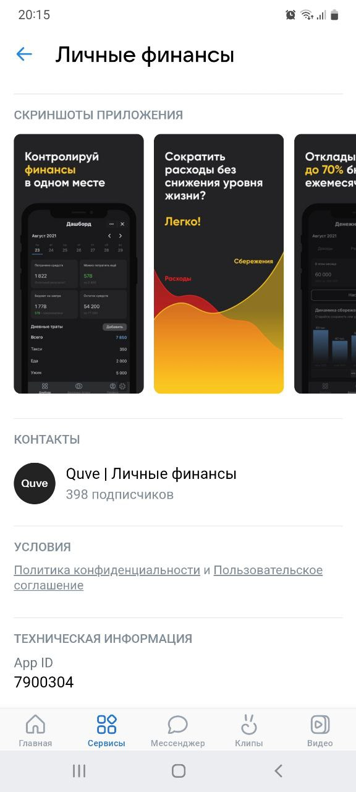

Как найти:

1. Откройте мобильное приложение ВКонтакте.
2. Перейдите в раздел Сервисы.
3. Выберите приложение и нажмите на его название.
4. Нажмите кнопку •••.
5. Нажмите кнопку О приложении.
6. Перейдите к разделу Условия.

Дополнительно

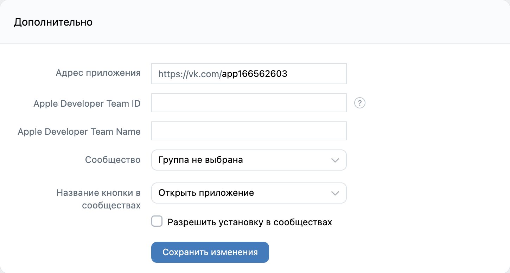

Адрес приложения

Примечание. Поле появляется только после публикации мини-приложения в каталоге.

Короткий адрес мини-приложения.

Минимальное количество символов — 5, максимальное — 32.

Используйте короткий адрес мини-приложения, чтобы пользователи могли быстро его запомнить. Пример: https://vk.com/dating.

Apple Developer Team ID и Apple Developer Team Name

Блок содержит информацию о мини-приложении, которое запускается на платформе iOS. Заполните поля, если вы являетесь участником Apple Developer Program.

Поля требуется заполнить, чтобы запускать мини-приложение из ODR-архива на iOS-устройствах. Заполненное поле Apple Developer Team ID нельзя очистить.

Без этой информации ваше мини-приложение не сможет попасть в каталог на платформе iOS.

Сообщество

Укажите в поле сообщество, которое будет считаться автором мини-приложения. После модерации сменить официальное сообщество можно будет только через год.

Название кнопки в сообществах

Название отображается на кнопке в Меню сообщества.

Разрешить установку в сообществах

Выберите Разрешить установку в сообществах, чтобы добавить кнопку с мини-приложением и запускать его от имени сообщества.

Загрузка приложения

Подробнее о функциональности загрузки приложения читайте на странице Экран запуска приложения.

Настройки сниппета

Сниппет — это блок с картинкой и кнопкой, который появляется при публикации ссылки в записи сообщества или в личном сообщении.

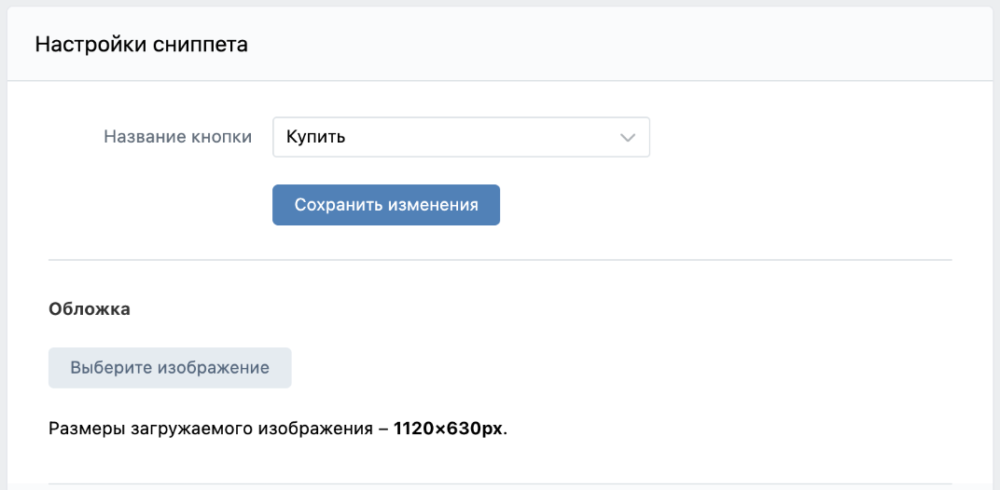

Название кнопки

Название кнопки отображается при публикации ссылки на мини-приложение в записи сообщества или в личном сообщении.

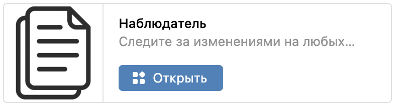

Обложка

Изображение, которое отображается в сниппете при публикации ссылки на мини-приложение в записи сообщества.

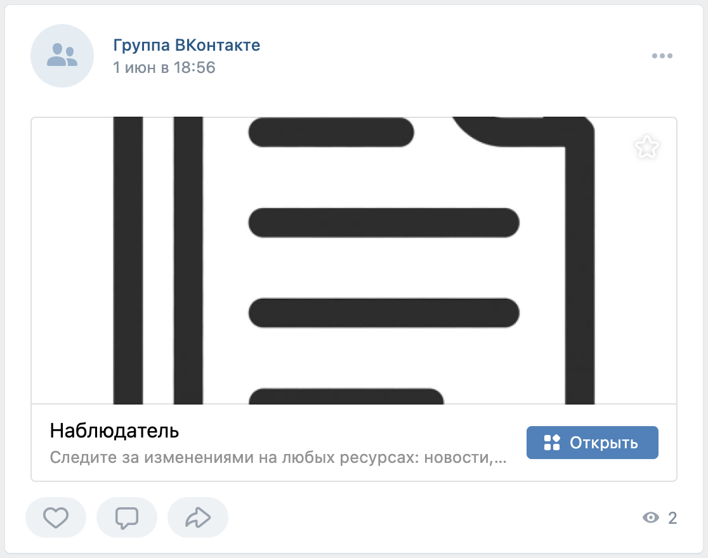

• Размер: 1120×630 px.

• Формат: JPG или PNG.

Обложки и скриншоты

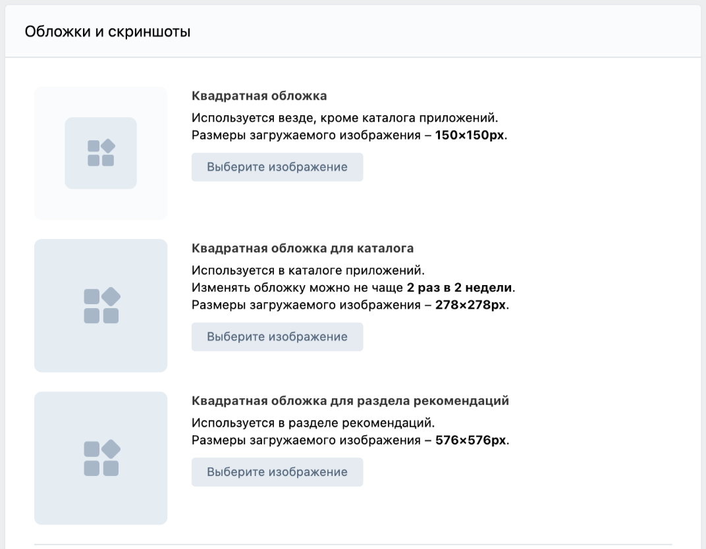

Квадратная обложка

Изображение обложки используется в каталоге мобильной версии ВКонтакте, уведомлениях мини-приложения и настройках мини-приложений в сообществах.

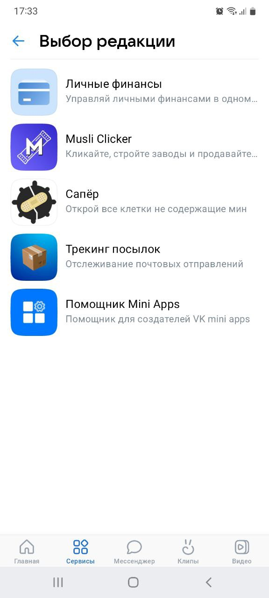

• Размер: 150×150 px.

• Формат: JPG, PNG или GIF.

Квадратная обложка для каталога

Изображение, которое используется в сниппете при публикации ссылки на мини-приложение в личном сообщении, на ярлыке мини-приложения на мобильном устройстве, а также в каталоге мини-приложений.

Изображение загружается автоматически, если загружена квадратная обложка.

Параметры изображения:

• Размер: 278×278 px.

• Формат: JPG, PNG или GIF.

Менять обложку можно не чаще 2 раз в 2 недели.

Иконка для мобильного каталога

Цвет основы квадратной обложки для каталога выбирается автоматически на основе доминирующего цвета в обложке. Вы можете настроить его вручную. Ко всем цветам применяется эффект прозрачности в 12%.

Цвет основы указывается для светлой и тёмной тем в виде HEX-кода.

Квадратная обложка для раздела рекомендаций

Изображение, которое используется в разделе рекомендаций.

• Размер: 576×576 px.

• Формат: JPG, PNG, GIF или BMP.

Скриншоты приложения

Скриншоты мини-приложения используются на экране установки, а также в разделе Скриншоты приложения в мобильном приложении ВКонтакте. Скриншоты нужно загружать по одному.

Параметры скриншота:

• Высота: не менее 600 пикселей.

• Формат: JPG, PNG, GIF или BMP.

• Отношение сторон не более 2 к 1.

Как найти:

1. Откройте мобильное приложение ВКонтакте.
2. Перейдите в раздел Сервисы.
3. Выберите приложение и нажмите на его название.
4. Нажмите кнопку •••.
5. Нажмите кнопку О приложении.
6. Перейдите к разделу Скриншоты приложения.